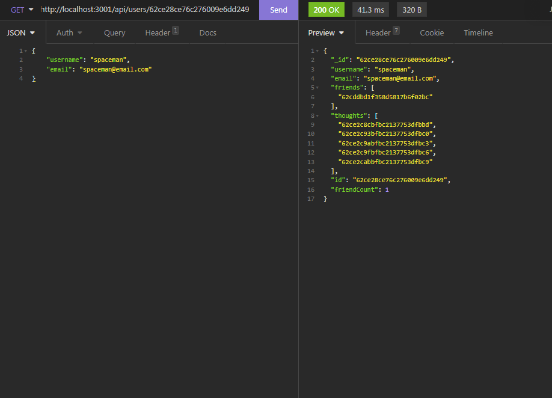
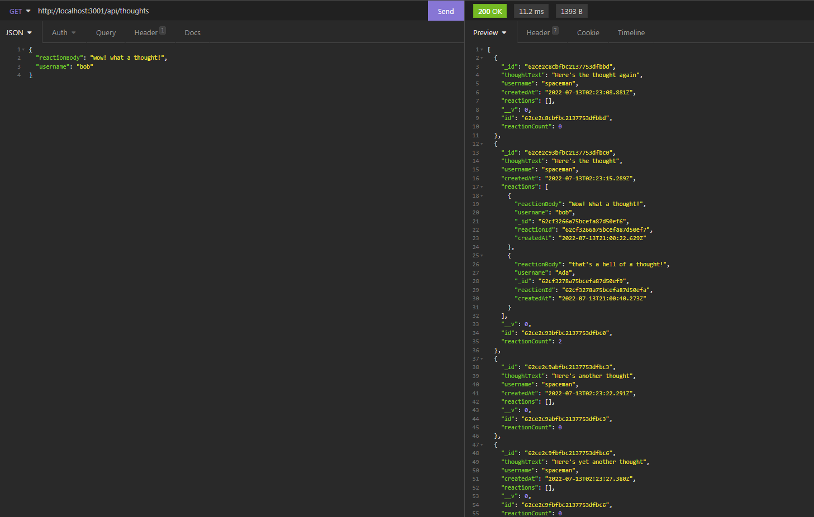

# Social Network
  

  ## Description

  The application is a backend for a social  network. It consists of three models: users, thoughts, and schemas. Users can post thoughts, and add other users as friends. Users can post multiple thoughts, and can also react to thoughts.
  the application is tested through Insomnia, as there is currently no front-end to work with.

## Table of Contents

- [Installation](#installation)
- [Usage](#usage)
- [License](#License)
- [Contributing](#contributing)
- [Tests](#tests)
- [Questions](#questions)
- [Screenshots](#screenshots)
- [Links](#links)

  ## Installation

  Run npm install to install express and mongoose.
  
  ## Usage

  Use Insomnia to run the HTTP requests to the application.

  ## License

  This project is licensed under the GNU GPLv3 license. Read more about the license here:
  https://choosealicense.com/licenses/gpl-3.0/
  

  ## Contributing

  Please fork and submit a pull request.

  ## Tests

  Test using a variety of inputs.

  ## Questions

  You can reach me at GitHub; my username is nathanh635 and my profile is here: https://github.com/nathanh635. 
  You can also email me at nathanh635@gmail.com. 
  
  ## Screenshots

  Below is a screenshot of the tested application.

  
## Links

  Repository: https://github.com/nathanh635/Social-Network
  
  Video Walkthrough: https://drive.google.com/drive/folders/1jjZHsw1xCagscyZc65egFiHzQ_krQKYM?usp=sharing

